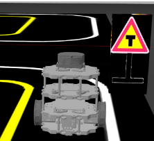
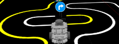
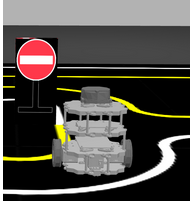
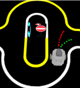
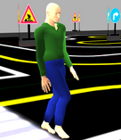
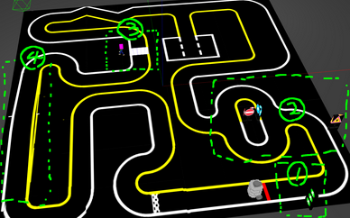
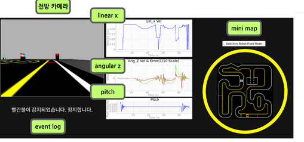
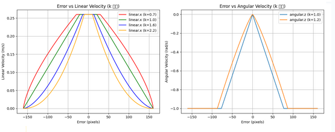
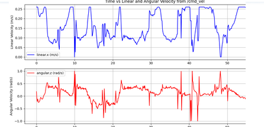
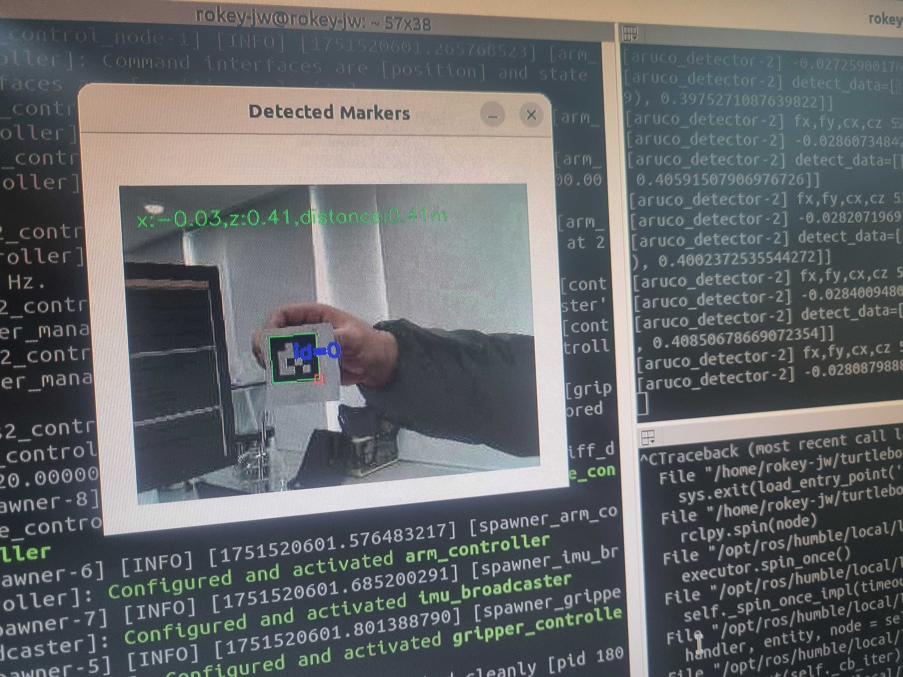

# 🧠 ROS2 기반 자율주행 시뮬레이션 프로젝트

본 프로젝트는 TurtleBot3를 활용한 **ROS2 기반의 자율주행 로봇 시스템**으로, 다양한 교통 표지판 인식, 차선 기반 경로 추종, 교차로 판단 및 회피 등의 기능을 통합하여 실제 도로 상황과 유사한 시나리오를 구현했습니다.
## 🎬 데모 영상

| 실제 환경 주행 | Gazebo 시뮬레이션 |
|----------------|------------------|
|  |  |

## 📌 프로젝트 주요 시나리오

### 1️⃣ T자 교차로 및 교차로 진입 판단
  
- 교차로 진입 전 `T자 경고 표지`를 인식하고 상태를 전이합니다.

---

### 2️⃣ 우회전 유도 표지판 대응
  
- 교차로에서 파란색 우회전 표지판을 인식한 뒤, 우회전 경로로 진입합니다.

---

### 3️⃣ 진입 금지 구간 대응
  
- 빨간 진입 금지 표지판 인식 시, 해당 방향 진입을 회피하고 다른 경로를 선택합니다.

---

### 4️⃣ 일반 모드 돌입 각도 판단
  
- 교차로에서 빠져나오는 조건을 각도로 판단합니다.
### 5️⃣ 사람 탐지 및 경로 변경
  
- 횡단보도 에서 사람이 감지되면 일시 정지 후 안전하게 우회합니다.

---

## 🗺️  전체 경로 및 구간 번호 매핑
  

- 총 4개의 주요 구간:
  - ① 출발 및 일반 차선 주행
  - ② 진입 금지 및 사람 감지 시나리오
  - ③ 교차로 판단 및 우회전
  - ④ 마지막 우회도로 및 탈출
---

## 🎛️ 6️⃣ 시각화 UI (디버깅 및 실시간 정보 확인)
  
- 전방 카메라 / mini map
- 선속도(`linear x`) / 각속도(`angular z`) / 피치(`pitch`)
- 이벤트 로그 (예: “빨간불이 감지되었습니다. 정지합니다.”)

---
##실제 터틀봇 주행
## 🛣️ Lane Detection Optimization

### ⚙️ Why Optimization Was Needed
- 시뮬레이션과 달리 실제 주행에서는 **하드웨어 성능 한계**와 **강한 빛 반사** 문제가 발생했습니다.
- `라인트레이싱 + MoveIt 동작`을 동시에 수행하기 위해서는 **최적화된 라인트레이싱**이 필수였습니다.

---

### 📉 Optimization Strategy
- **이미지 화질**: 320x240
- **형식 변경**: 컬러 영상 → 흑백 `compressed` 영상
- **연산 간소화 및 빛 반사 제거**:
  - 흑백 영상에서 **임계값 기반 이진화**
  - **모폴로지 연산**으로 작은 빛 반사 제거
  - **contour 추출**
  - `area < 500`인 contour 제거

| 곡선 영역 원본 | 곡선 영역 필터링 결과 |
|:--:|:--:|
|  |  |

---

### ➗ 차선 분리 방식

#### ✅ 1개 라인만 검출된 경우
- 검출된 라인의 **2차 다항식 근사 → 기울기 추출**
- **기울기(angle)** 기준 판단:
  - `> +10도`: 좌회전 중 → **오른쪽 차선**
  - `< -10도`: 우회전 중 → **왼쪽 차선**
  - `-10 ~ +10도`: 직진 → x 좌표 기준으로 왼/오 판단

#### ✅ 2개 이상 라인 검출된 경우
- 가장 큰 **2개 contour 선택**
- 각 contour의 중심 x값 비교 → 왼/오 차선 분리

| 2개 라인 탐지 예시 | 터미널 출력 |
|:--:|:--:|
|  |  |

---

### 🧠 fit_from_lines() 한계 보완
- 기존의 `fit_from_lines()`는 속도는 빠르지만 **곡선 구간**에서 성능 저하
- → **곡선 상황에선 sliding window 방식으로 탐색** 전환

| 곡선 구간 판단 예시 | 출력 |
|:--:|:--:|
|  |  |

---

### 🧩 H자 차선 문제 해결
- 아래 이미지처럼 H자 모양 차선을 **하나의 contour**로 판단 → 라인 분리 실패

| H자 차선 원본 | 추출 결과 |
|:--:|:--:|
|  |  |

- 해결 전략:
  - **Contour 영역이 20,000 이상일 경우**
  - 중심선을 기준으로 **contour 분할**
  - 라인 분리 성공

| 분할 로직 적용 출력 |
|:--:|
|  |

---

### ✅ 결과
- 빛 반사 제거 및 연산 최적화로 **안정적인 라인트레이싱 성능 확보**
- 다양한 상황 (곡선/직선/H자)에서도 **유연한 차선 분리** 가능

---

## 📈 7️⃣ 비선형 속도 제어 설계 (에러 기반)
  
- 차선 중심 에러 기반 속도 조절 그래프
  - 왼쪽: 에러 vs 선속도
  - 오른쪽: 에러 vs 각속도
- `k` 값에 따른 제어 반응 곡선 차이 시각화

---

## 📉 8️⃣ 실제 주행 로그 (시간 vs 속도)
  
  
- 상단: 선속도(`linear.x`) 로그
- 하단: 각속도(`angular.z`) 로그  
- 정지/회전/진입 상황에서의 속도 변화 확인 가능

## 🧲 ArUco 마커 인식 및 좌표 검출
#🎥 실시간 ArUco 마커 기반 좌표 검출 및 Pick-and-Place 

   - 실시간으로 ArUco 마커를 인식한 후, 마커의 3D 위치를 추정하여 로봇 팔이 해당 위치로 이동해 집는 동작을 수행합니다.

   - ROS2 기반으로 camera → aruco_detector 노드 → MoveIt 연동까지 전체 자동화 흐름을 구성했습니다.

#🖥️ ArUco 마커 인식 시각화 및 3D 위치 표시

-    좌측 화면에서는 id=0 마커가 인식되었고, 화면 상단에 x=-0.03, z=0.41, distance=0.41m 등 상대 좌표가 표시됩니다.

  -  우측 단말기에는 내부적으로 추정된 마커의 위치(fx, fy, cx, cy, tvec, rvec)와 디버그 로그가 출력됩니다.

   - 본 프로젝트에서는 이 정보를 활용해 로봇 팔이 마커 기준 위치로 이동하여 물체를 집는 pick 작업을 수행합니다.

 -   거리(z), 좌우(x) 좌표를 기반으로 잡을 위치를 보정하며, 좌표계 변환을 통해 camera → base_link → end-effector 프레임으로 일관된 제어를 구현했습니다.
---
## 🎯 프로젝트 목표

- 복잡한 도시형 교차로 시나리오에서 자율적으로 판단하고 회피할 수 있는 FSM 기반 자율주행 시스템 구현
- 단순 센서 입력이 아닌 **인지-판단-제어-UI**가 유기적으로 연결된 구조 설계
- Gazebo 디지털 트윈 시뮬레이션과 실제 환경 모두에서 검증된 안정성

## 💡 주요 기여 포인트

- FSM(상태기반 제어) + PD 제어 기반 안정적 차선 주행
- SIFT을 통한 사람/표지판 인식 연동
- pyqt 활용 실시간 UI 디버깅 툴 

## 🧠 시스템 요약

| 항목 | 내용 |
|------|------|
| 운영 환경 | ROS2 (Humble), Gazebo |
| 핵심 기능 | 차선 인식, 표지판 감지, 사람 감지, PD 제어 |
| 입력 센서 | 카메라 (압축 영상), IMU |
| 제어 방식 | 상태기반 FSM + 비선형 PD 제어 |
| 사용 토픽 | `/cmd_vel`, `/detect/lane`, `/detect/traffic_light`, `/camera/image/compressed` 등 |

---

## ✍️ 작성자
- **이름**: 이희우  

