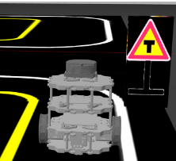
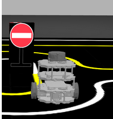
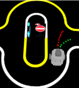
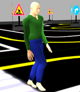
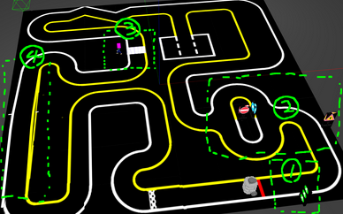
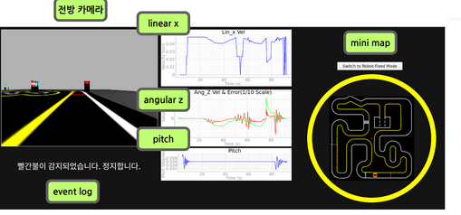
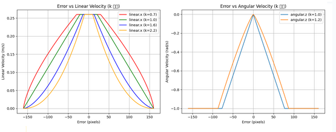
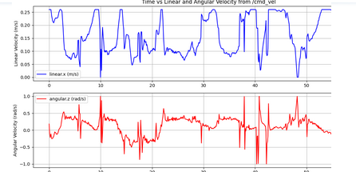

# 🧠 ROS2 기반 자율주행 시뮬레이션 프로젝트

본 프로젝트는 TurtleBot3를 활용한 **ROS2 기반의 자율주행 로봇 시스템**으로, 다양한 교통 표지판 인식, 차선 기반 경로 추종, 교차로 판단 및 회피 등의 기능을 통합하여 실제 도로 상황과 유사한 시나리오를 구현했습니다.
## 🎬 데모 영상

| 실제 환경 주행 | Gazebo 시뮬레이션 |
|----------------|------------------|
|  |  |

## 📌 프로젝트 주요 시나리오

### 1️⃣ T자 교차로 및 교차로 진입 판단
  
- 교차로 진입 전 `T자 경고 표지`를 인식하고 상태를 전이합니다.

---

### 2️⃣ 우회전 유도 표지판 대응
  
- 교차로에서 파란색 우회전 표지판을 인식한 뒤, 우회전 경로로 진입합니다.

---

### 3️⃣ 진입 금지 구간 대응
  
- 빨간 진입 금지 표지판 인식 시, 해당 방향 진입을 회피하고 다른 경로를 선택합니다.

---

### 4️⃣ 일반 모드 돌입 각도 판단
  
- 교차로에서 빠져나오는 조건을 각도로 판단합니다.
### 5️⃣ 사람 탐지 및 경로 변경
  
- 횡단보도 에서 사람이 감지되면 일시 정지 후 안전하게 우회합니다.

---

## 🗺️  전체 경로 및 구간 번호 매핑
  

- 총 4개의 주요 구간:
  - ① 출발 및 일반 차선 주행
  - ② 진입 금지 및 사람 감지 시나리오
  - ③ 교차로 판단 및 우회전
  - ④ 마지막 우회도로 및 탈출
---

## 🎛️ 6️⃣ 시각화 UI (디버깅 및 실시간 정보 확인)
  
- 전방 카메라 / mini map
- 선속도(`linear x`) / 각속도(`angular z`) / 피치(`pitch`)
- 이벤트 로그 (예: “빨간불이 감지되었습니다. 정지합니다.”)

---

## 📈 7️⃣ 비선형 속도 제어 설계 (에러 기반)
  
- 차선 중심 에러 기반 속도 조절 그래프
  - 왼쪽: 에러 vs 선속도
  - 오른쪽: 에러 vs 각속도
- `k` 값에 따른 제어 반응 곡선 차이 시각화

---

## 📉 8️⃣ 실제 주행 로그 (시간 vs 속도)
  
  
- 상단: 선속도(`linear.x`) 로그
- 하단: 각속도(`angular.z`) 로그  
- 정지/회전/진입 상황에서의 속도 변화 확인 가능

---
## 🎯 프로젝트 목표

- 복잡한 도시형 교차로 시나리오에서 자율적으로 판단하고 회피할 수 있는 FSM 기반 자율주행 시스템 구현
- 단순 센서 입력이 아닌 **인지-판단-제어-UI**가 유기적으로 연결된 구조 설계
- Gazebo 디지털 트윈 시뮬레이션과 실제 환경 모두에서 검증된 안정성

## 💡 주요 기여 포인트

- FSM(상태기반 제어) + PD 제어 기반 안정적 차선 주행
- SIFT을 통한 사람/표지판 인식 연동
- pyqt 활용 실시간 UI 디버깅 툴 

## 🧠 시스템 요약

| 항목 | 내용 |
|------|------|
| 운영 환경 | ROS2 (Humble), Gazebo |
| 핵심 기능 | 차선 인식, 표지판 감지, 사람 감지, PD 제어 |
| 입력 센서 | 카메라 (압축 영상), IMU |
| 제어 방식 | 상태기반 FSM + 비선형 PD 제어 |
| 사용 토픽 | `/cmd_vel`, `/detect/lane`, `/detect/traffic_light`, `/camera/image/compressed` 등 |

---

## ✍️ 작성자
- **이름**: 이희우  

